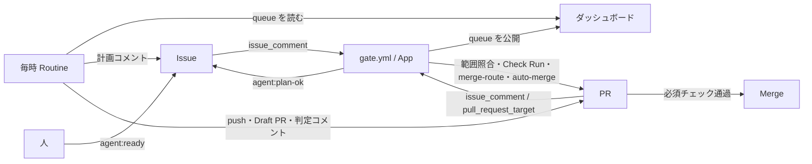

# Agent harness for GitHub Issues × Claude Code

GitHub Issues を開発状態の唯一の記録とし、Claude Code が Issue を起点に計画・実装・レビューを進め、Risk が low の変更は人手なしで Merge まで完走させるためのハーネス。



- **Claude**（毎時の Routine か人のセッション）：計画・実装・判定（Reviewer と Risk Agent）・修正
- **専用 GitHub App**（Actions の数秒のジョブ）：段階ゲート、判定の受け付け、必須チェック、auto-merge の制御、次にやることの計算。Claude は動かさない
- 信頼できる印は App が付けたものだけ。Claude は本人名義で動くため、名義では人と区別しない

## 文書

| 文書 | 内容 |
| --- | --- |
| [docs/setup.md](docs/setup.md) | 別のリポジトリへの導入手順 |
| [docs/operations.md](docs/operations.md) | Issue の書き方、ラベル、人が関わる場面、止める仕組み |
| [docs/risk-policy.md](docs/risk-policy.md) | 自動 Merge を決める8問と条件 |
| [docs/formats.md](docs/formats.md) | 計画・判定などの構造化コメントの書式 |
| [docs/security.md](docs/security.md) | 安全設計と受け入れているリスク |
| [docs/glossary.md](docs/glossary.md) | 用語集 |
| [docs/migration.md](docs/migration.md) | 個人の public から組織の private への移行 |
| [docs/plan.md](docs/plan.md) | 計画と決定ログ |

## 開発

Node 24（`.node-version`）。TypeScript をビルドせずに実行する。

```bash
npm ci
npm run check
```
