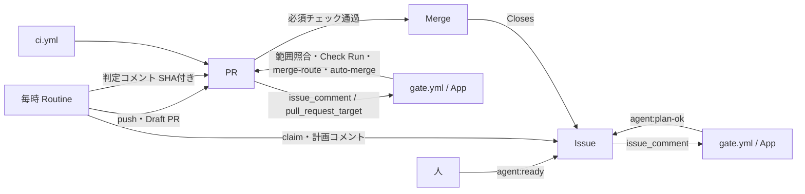

# gen-ai-development-kit

GitHub Issues を開発状態の SSoT とし、Claude Code が Issue を起点に計画・実装・レビューを進め、Risk が low の変更は人手なしで Merge まで完走させるためのハーネスです。

- 計画: [docs/plan.md](docs/plan.md)
- 実装との対応と進捗: [docs/implementation.md](docs/implementation.md)
- Phase 0 検証: [docs/phase0.md](docs/phase0.md)
- セットアップ: [docs/github-app-setup.md](docs/github-app-setup.md) → [docs/routine-setup.md](docs/routine-setup.md)
- 用語集: [docs/glossary.md](docs/glossary.md)
- 運用: [docs/runbook.md](docs/runbook.md)、[docs/issue-contract.md](docs/issue-contract.md)、[docs/risk-policy.md](docs/risk-policy.md)、[docs/formats.md](docs/formats.md)、[docs/security.md](docs/security.md)
- 移行: [docs/migration.md](docs/migration.md)

## 流れ



## 開発

Node 24（`.node-version`）。ビルドなしで TypeScript を直接実行します。

```bash
npm ci
npm run check
```
