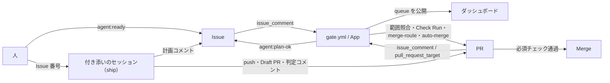

# Agent harness for GitHub Issues × Claude Code

GitHub Issues を開発状態の唯一の記録とし、Claude Code が Issue を起点に計画・実装・レビューを進め、Risk が low の変更は人手なしで Merge まで完走させるためのハーネス。



- **Claude**（人が付き添うセッション）：計画・実装・判定（Reviewer と Risk Agent）・修正。Issue 番号を渡すと、ship の skill（[.claude/skills/ship/SKILL.md](.claude/skills/ship/SKILL.md)）が各段階の skill をつなぎ、人の Merge 待ちか人の判断待ちまで進める
- **専用 GitHub App**（Actions の数秒のジョブ）：段階ゲート、判定の受け付け、必須チェック、auto-merge の制御、次にやることの計算。Claude は動かさない
- 毎時の Routine（[.claude/routine.md](.claude/routine.md)）で Claude を定期に動かすのは将来の構想
- 信頼できる印は App が付けたものだけ。Claude は本人名義で動くため、名義では人と区別しない

図で全体を見るなら [overview.html](overview.html)（流れ・誰が何をするか・ディレクトリの地図・ラベルの意味）。GitHub の画面ではソースのまま表示されるので、手元に clone してブラウザで開く。各ディレクトリの中身は、そのディレクトリの README.md に1行ずつ書いてある。

## 文書

| 文書 | 内容 |
| --- | --- |
| [docs/setup.md](docs/setup.md) | 別のリポジトリへの導入手順 |
| [docs/operations.md](docs/operations.md) | Issue の書き方、ラベル、人が関わる場面、止める仕組み |
| [docs/risk-policy.md](docs/risk-policy.md) | 自動 Merge を決める8問と条件 |
| [docs/formats.md](docs/formats.md) | 計画・判定などの構造化コメントの書式 |
| [docs/security.md](docs/security.md) | 安全設計と受け入れているリスク |
| [docs/glossary.md](docs/glossary.md) | 用語集 |
| [docs/migration.md](docs/migration.md) | 個人の public から組織の private への移行 |
| [docs/plan.md](docs/plan.md) | 計画と決定ログ |

## `.github/`

GitHub の設定。ここはガードレール（変えると人が Merge する場所）。`.github/` に README.md を置くと、GitHub がリポジトリのトップにこのファイルの代わりにそれを出すため、説明はこの節に書く。

| 名前 | 内容 |
| --- | --- |
| `ISSUE_TEMPLATE/` | Issue の作り方の設定。`agent-task.yml` は「Agent タスク」の Issue Form（Goal・Requirements・Acceptance Criteria などの見出しをゲートが読む）、`config.yml` は Form を使わない Issue も作れるようにする設定。ここに .md を置くと Issue のテンプレートとして扱われるので、README は置かない |
| `pull_request_template.md` | PR 本文の見本（`Closes #番号`、変更の概要、AC ごとの対応、範囲外の変更、テスト） |
| `workflows/` | GitHub Actions の設定（CI とゲート）。中身は [.github/workflows/README.md](.github/workflows/README.md) |

## 開発

Node 24（`.node-version`）。TypeScript をビルドせずに実行する。

```bash
npm ci
npm run check
```
