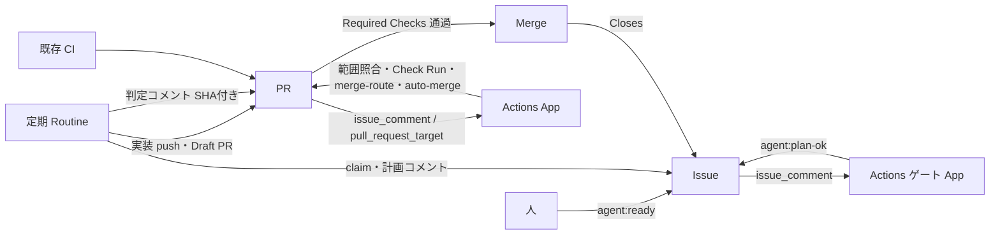

# GitHub Issues SSoT × Claude Code 自律開発 計画（改訂版）

Sep 26, 2026

## 目的と前提

GitHub Issues を開発状態の SSoT とし、Claude Code が Issue を起点に計画・実装・レビューを自律的に進め、Risk が low の変更は人手なしで Merge まで完走させる。

| 項目 | 前提 |
| --- | --- |
| 構築場所 | 個人アカウントのパブリックリポジトリでハーネスを構築 |
| 移行先 | ある程度完成したら GitHub Team 組織の private リポジトリへ移す |
| Claude の課金 | Claude Team プランのサブスクリプションのみ（API キー不使用） |
| GitHub Actions | private では課金対象になるため、Claude の処理には使わない。数秒で終わる決定論的ジョブと既存 CI のみ |
| Claude の起動経路 | 人が立てたセッション、または定期実行の Routines の2つだけ。GitHub イベントで Claude を直接起動しない |
| GitHub 名義 | Claude はユーザー自身の GitHub アカウントとして動く |
| Risk 判定 | 当面は Claude、将来は TypeSafe AI の Jev に移行 |

最終原則は元計画を引き継ぐ。GitHub を開発 OS とし、自動化は Risk に応じて開放し、Agent の自己申告を唯一の根拠にしない。

## 元計画からの主な変更点

実行基盤・状態管理・Risk 判定・承認の4点が大きく変わった。いずれも「Team サブスクのみ」「private での Actions 課金回避」「個人アカウントで開始」という前提から導かれている。

| 観点 | 元計画 | 改訂版 | 理由 |
| --- | --- | --- | --- |
| Orchestrator | GitHub Agentic Workflows（gh-aw） | Claude Code Routines（定期実行）＋付き添いのセッション＋軽い Actions | gh-aw はサブスク OAuth 非対応。private での Actions 課金回避 |
| 状態管理 | Issue Fields | ラベル（`agent:*`、`risk:*`） | 個人アカウントでは Issue Fields が使えない。移行後に再検討可 |
| Risk 段階 | R0〜R4 | low / medium / high / critical（Agent のみが付与） | low = R0+R1 |
| Risk 判定 | Changed Paths から機械判定 | Claude が8問の型付き質問に答え、将来 Jev に移行 | 意味的な判定が必要。確率付き判定へ段階移行 |
| 自動 Merge | Phase 4 で R0/R1 から検討 | low は Phase 4 で即有効化 | 運用方針 |
| 計画承認 | 初期は全件 | 人間の判断が必要な場合のみ。承認＝人が付き添いのセッションで進めると決める | 名義が同一のため、ラベル承認は偽装を防げない |
| 書き込み | Safe Outputs | Routine は `claude/` ブランチ・PR・コメントまで。信頼が必要なラベル、Check Run、merge-route、auto-merge は専用 GitHub App のみ（既定ブランチの YAML から） | 本人名義と区別でき、PR 側から偽装できないのは App だけ。`GITHUB_TOKEN` は後続 workflow を起動せず、`github-actions[bot]` は PR 側から名乗れる |
| Protected Files | パス保護 | ガードレール（`guardrailPaths`）に触れる PR は App がパスで自動 Merge から外す（Q82） | 保護するのは Agent が自分を縛る仕組みと、判定の連鎖（入力の作り方・組み立て・手順）と、導入先の下限（Q85） |

## アーキテクチャ

Claude が動く処理はすべて Routines か付き添いのセッションに置き、GitHub Actions には Claude を動かさない数秒のジョブだけを残す。Actions の費用はほぼ Claude の実行時間なので、これで private 移行後も GitHub Team の無料枠に収める。

| 構成要素 | 担当 | 動く場所 | GitHub 上の名義 |
| --- | --- | --- | --- |
| 定期実行 Routine（1本、毎時） | 進められる Issue・PR を1段階ずつ進める（計画・実装・Reviewer・Risk・修正） | Anthropic のクラウド | ユーザー本人 |
| 付き添いのセッション | 承認が必要な Issue と急ぎの Issue の実装、手動の介入（PR は `claude/` ブランチの Agent PR） | 手元またはクラウドの Claude Code | ユーザー本人 |
| 軽い Actions（決定論的ジョブ） | 段階間のゲート、範囲照合、Check Run 作成、merge-route、auto-merge 制御、依存解消、親 Issue の Close、停滞検知、Jev 呼び出し | GitHub Actions（既定ブランチの YAML のみ） | 専用 GitHub App |
| 既存 CI | Build・Lint・Typecheck・Test・Security | GitHub Actions | `github-actions[bot]` |
| GitHub 標準機能 | Ruleset、Required Checks、auto-merge、Sub-issues、Dependencies | GitHub | — |
| Jev | Risk 判定（シャドー運用 → 本番） | TypeSafe AI の API（Actions から呼ぶ） | — |

**名義と信頼**：信頼できる印は専用 GitHub App が付けたものだけと定義する。Routine と付き添いのセッションはどちらもユーザー本人として記録されるため、偽装されては困る印（段階ゲート、判定結果の確定、merge-route、auto-merge）は必ず App が付ける。`github-actions[bot]` は信頼の根にしない。`pull_request` で起動する workflow は PR 側の YAML で動き、同じ名義で書き込めてしまうためである。

**ゲートの起動**：ゲートの workflow は既定ブランチの YAML だけが動くトリガーで起動する。コメントが起点のもの（計画ゲート、判定の受け付け）は `issue_comment`、PR が起点のもの（push 検知で auto-merge を解除する処理など）は `pull_request_target` とし、PR の head を checkout せず、PR の中身は API で読むだけにする。パブリックリポジトリでは fork を無効にできないため、PR のコードを実行しないことが秘密（App の鍵、Jev の鍵）を守る前提になる。

**App を使う理由**：`GITHUB_TOKEN` で行った Merge・Close・Ready 化は後続の workflow（main の CI、依存解消、`ready_for_review` のジョブ）を起動しない。App のトークンならこれが起動する。Ruleset の必須チェックの出どころもこの App に固定し、ユーザーの名義で同名のチェックを置いても通らないようにする。

## Issue 契約・ラベルと状態モデル

状態はラベルで持ち、ラベルには人間の判断点と Agent の進捗だけを載せる。PR や Checks から分かる状態（レビュー中・CI 中）と DONE（Issue が Closed）はラベルにしない。

| ラベル | 付ける者 | 意味 |
| --- | --- | --- |
| `agent:ready` | 人 | 着手してよい。Routine が次の実行で拾う |
| `agent:working` | Routine / 付き添いのセッション | 着手宣言（claim）。着手者（Routine の実行 URL か「手動」）をコメントに残す。Routine はこのラベルの Issue をスキップする。着手者が Routine の実行で、その実行がすでに終わっている場合に限り、次の Routine が引き継ぐ。付き添いのセッションの着手は奪わず、6 時間（目安）進展がなければ停滞として表示する |
| `agent:plan-review` | Routine | 計画済み、人間の判断が必要。Routine は以後この Issue の実装をしない |
| `agent:plan-ok` | App のみ | 計画が停止基準に該当しないことを確認済み。Routine はこのラベルが App によって付けられた Issue だけを実装する |
| `agent:in-pr` | Routine | Draft PR 作成済み |
| `agent:waiting` | Routine / App | 依存待ち。blocker が閉じると App が外す |
| `agent:blocked` | Routine / App / 人 | 仕様確認、修正上限超過、Issue が読めない（書式不一致）など、人の対応が必要 |
| `agent:hold` | 人 | 個別停止。PR なら merge-route が failure を返し、Issue なら Routine が処理しない。Routine も同じ名義で外せてしまうため、外されたら App が記録してコメントで知らせる |
| `risk:low` / `medium` / `high` / `critical` | Routine | 計画時の想定 Risk（表示用。Merge 可否は実 diff の判定で決まる） |

Issue Forms の項目は元計画の6章（Goal、Background、Requirements、Non-goals、Acceptance Criteria、Dependencies、Validation Requirements）を引き継ぐ。Risk と Priority はフォームに入れない（Risk は Agent が付与するため）。

Issue Forms は `###` 見出しで出力される。フォームの定義とゲートの読み取り処理は同じ PR でテストし、読めない Issue は静かに止めず `agent:blocked` にして見える状態にする。

構造は元計画どおり、大きな機能は Epic と Sub-issues、順序は Issue Dependencies で表す。Agent は未解決の blocker を持つ Issue に着手せず、`agent:waiting` を付けて待つ。

移行先が GitHub Team の組織リポジトリになると Issue Fields が使えるようになる。ラベルから切り替えるかは移行時に判断する。

## 開発フロー

毎時1本の Routine が、その時点で進められる Issue・PR をまとめて1段階ずつ進める。段階の間には Actions のゲートを挟むため、1 Issue は数時間かけて進む前提とする。

急ぎの Issue は定期実行を待たず、付き添いのセッションで進める。

1. **起動**：人が Issue に `agent:ready` を付ける。
2. **着手宣言**：Routine（または付き添いのセッション）は作業の前に `agent:working` を付け、着手者をコメントに残す。各段階は開始時に GitHub の状態（ブランチ、PR、計画コメント、ラベル）を読み直し、途中まで済んだ作業は続きから進める（冪等に動く）。
3. **計画（Routine）**：Issue 本文と、コラボレーターのコメントだけを読み、計画を Issue コメントとして投稿する。コメントには構造化出力（想定 Risk、人間の判断が必要かのフラグ、Open Questions、**触るファイル一覧**）を含める。触るファイル一覧は必須とする。要件や AC の変更が必要なら提案だけをコメントし、Issue 本文は書き換えない。
4. **ゲート（App、`issue_comment` 起動）**：計画の構造化出力を読み、次のどれにも該当しなければ `agent:plan-ok` を付ける。該当すれば Routine が付けた `agent:plan-review` のまま停止する。
   - 人間の判断が必要（仕様の曖昧さ、AC 変更の提案、Issue 範囲を超える設計判断）
   - 想定 Risk が high 以上
   - 触るファイル一覧が欠けている
5. **承認経路**：`agent:plan-review` の Issue は、付き添いのセッションで実装する。Routine は手を出さない。
6. **実装（Routine）**：App が `agent:plan-ok` を付けた Issue だけを対象に、投稿済みの計画コメントを入力として実装する（承認後に Issue 本文が書き換えられても影響しない）。Test Designer は実装内のサブエージェント。`claude/` ブランチに push し、Draft PR を作成する。PR 本文に `Closes #番号` と実行セッションの URL を入れる。
7. **範囲照合（App）**：実際の diff が計画の触るファイル一覧に収まるかを機械的に検査する。はみ出していれば自動 Merge の対象外とし（Human Merge は可）、Reviewer への入力にも含める。
8. **判定（Routine、次の実行）**：Reviewer と Risk Agent を別のサブエージェントとして実行し、結果を head SHA 付きの構造化コメントとして PR に投稿する。
9. **確定（App、`issue_comment` 起動）**：判定コメントを受け付け、`agent/review` と `agent/risk` の Check Run を書く。受け付けるのは、判定時の head と現在の head で「PR が main に対して加えた変更」（`git patch-id`）が同一の場合。main 追従で差分が変わらなければ判定し直さない。Jev のシャドー判定もここで呼ぶ。
10. **Merge**：
    - low かつ Reviewer 合格かつ範囲照合 OK → Draft を外し auto-merge を設定。Required Checks（既存 CI＋`agent/review`＋merge-route）通過で GitHub が Merge
    - medium 以上かつ Reviewer 合格 → Draft を外し、人にレビューを依頼（Human Merge）
    - Reviewer のブロッキング指摘 → Draft のまま、変更要求として投稿し修正へ
11. **修正（Routine）**：変更要求（Reviewer または人）を受けて修正し push。push のたびに App が auto-merge を即解除し、差分が変わっていれば判定をやり直す。
12. **Close**：Merge で `Closes` により子 Issue が閉じる。Sub-issues がすべて閉じた親 Issue は App が閉じる。

**merge-route**：App が書く必須チェック。auto-merge が付いていない PR には success を返し（人が Merge する経路は通す）、auto-merge が付いた PR には、判定が現在の差分に対して有効で、low かつ Reviewer 合格かつ範囲照合 OK かつ `agent:hold` なし、のときだけ success を返す。これで medium の PR に auto-merge が付いても Merge されず、`agent/risk` を Required にしなくても Human Merge は通る。

**直接マージの防止**：auto-merge を使わずに API で直接マージする経路は merge-route では止められず、Routine と人は同じ名義なので GitHub 側では区別できない。リポジトリの `.claude/settings.json` で `gh pr merge` と merge API の呼び出しを deny にし、Ruleset の bypass には誰も入れない。Routine は既定ブランチから clone して始まるため、PR で設定を書き換えても次の実行には効かない。ただしコマンドパターンによる防止なので完全ではない。

**順序制御**：App は push を検知したら最初に auto-merge を解除し、判定の受け付け時は auto-merge の設定を先に済ませてから `agent/review` を書く。`agent/review` は Required なので、それが書かれるまで Merge されない。main とコンフリクトしている PR では `pull_request` の CI が起動しないため、停滞検知で拾う。

## Risk ポリシーと自動 Merge 条件

自動 Merge は Risk Agent の判定のみで決める。Risk Agent は Issue 本文・PR 説明・コメント・Planner のラベルといった自然言語の主張を読まず、diff・リポジトリ全体・このポリシーだけを入力にする。

判断軸は「壊れたときの影響範囲」と「revert で完全に元に戻るか」とし、観点を8問の型付き質問に分けて聞く。

| # | 質問 | 型 | 自動 Merge を止める答え |
| --- | --- | --- | --- |
| 1 | Risk レベルはどれか | Choice（low / medium / high / critical） | low 以外 |
| 2 | revert すれば完全に元に戻るか | Noul | いいえ・迷う |
| 3 | 公開インターフェース（API・スキーマ・イベント形式・設定形式）を変えるか | Noul | はい・迷う |
| 4 | 挙動を変える変更は、既存または追加されたテストで検証されているか（挙動を変えない変更だけなら yes。Q71） | Noul | いいえ・迷う |
| 5 | 永続データの書き込み・削除・移行を伴うか | Noul | はい・迷う |
| 6 | 認証・認可・課金・秘密情報に関わるか | Noul | はい・迷う |
| 7 | 依存関係（パッケージ・lockfile）を追加・更新するか | Noul | はい・迷う |
| 8 | ガードレール（`harness.config.json` の `guardrailPaths`）に触れるか（Q82） | Noul | はい・迷う |

レベルの目安は次のとおり。

- **low**（R0+R1）：壊れても利用者のデータ・認証・課金・外部連携に影響せず、revert で完全に戻る。docs、typo、独立した UI、挙動を変えない小さなリファクタ
- **medium**：業務ロジックや API の挙動が変わり得るが、revert で戻る
- **high**：revert しても戻らない影響があり得る、または影響が広い。マイグレーション、データの書き込み・削除、認証、課金、インフラ
- **critical**：ガードレール、権限、秘密情報、依存関係

**Claude 判定期間**：Noul は「はい／いいえ／迷う」の3択で答える。1つでも止める答えがあれば自動 Merge しない。Claude には確率も出させるが、較正の保証がないため判定には使わず記録のみとする。

**自動 Merge の条件**（すべて現在の差分に対して有効な判定で）：既存 CI 成功、`agent/review` 合格（ブロッキング指摘なし）、`agent/risk` が low かつ全 Noul が安全側、範囲照合 OK、`agent:hold` なし、自動 Merge モードが有効。merge-route がこれをまとめて検査する。PR の大きさには上限を置かず、Risk Agent の判断に任せる。

**Reviewer のブロッキング指摘**：直さない限り Merge させない指摘。次を常にブロッキングとし、スタイルや改善提案は非ブロッキングのコメントにとどめる。

- AC 未達
- Issue 範囲外の変更
- 型チェック・テストの失敗
- データ破壊
- 秘密の漏えい
- AC の外で既存の挙動が変わる退行

`agent/risk` は Required にしない。常に成功とし、判定結果はサマリーに書く。medium 以上を自動経路から外す役割は merge-route が担う。

**ガードレール**：Agent が自分を縛る仕組み（App が機械的に強制している部分）を `harness.config.json` の `guardrailPaths` に並べ、App がパスで判定する。触れる PR は Risk Agent の答えに関わらず自動 Merge から外し（Human Merge）、触れる計画は想定 Risk に関わらず計画ゲートで止める（Epic に分ける計画は子課題の files を見ず、子課題の計画で止める。Q83）。判定の連鎖（`harness/scripts/agent.ts`、judge・plan・sync・fix・ship の skill、`.claude/routine.md`、`CLAUDE.md`、plan-critic・test-designer の定義、Jev の切り替えの集計 `harness/scripts/report.ts`）も一覧に入る（Q85・Q86）。それ以外のハーネスの変更（implement・fleet の skill・テスト・docs など）は通常の判定で進める（Q82。Q4・Q50 を改める）。

## Jev への段階移行

Risk 判定は最終的に TypeSafe AI の Jev に任せる。Jev はテキストを生成せず、状態と型付きの質問を受けて確率付きの判定を返すモデルで、上の8問をそのまま1回の呼び出しで答えられる。

**役割分担**：Jev に渡す状態は App が API と設定から集めたものだけとし、セッションが書いたもの（Risk Agent の `facts`、Claude の判定）は含めない（含めるとセッションが Jev を誘導でき、一致率が独立性の証拠にならない）。Jev はリポジトリを読めないため、diff に見えない影響は分からないものとして安全側に倒す。

- 生の diff（Jev のコンテキスト 32K トークンに収まる範囲。収まらなければ自動 Merge の対象外）
- 変更ファイルの一覧（リネームの旧パスも）と、ガードレールの一覧（`guardrailPaths`・`guardrailExclude`）

**呼び出し場所**：Jev は Actions の決定論的ジョブから呼ぶ。Claude（ユーザー名義）から偽装できない位置に Risk 判定を置くためで、シャドー期間も同じ場所から呼ぶ。

**移行手順**

1. シャドー運用：Claude が判定し、Jev は同じ8問に答えて記録だけする（Phase 3 から）
2. 評価：比べる相手は Claude ではなく結果とする。Jev が「可」と判定した PR のうち、7 日以内に revert されたもの、同じファイルを直す fix の PR が出たものを「実は不可だった」と数える。Claude との一致率は PR の大半が low だと自然に高くなるため、切り替えの基準に使わない
3. 切り替え条件：結果で見た Jev の low の外れ、「Jev だけが可と判定した」ケース、否定側（medium 以上）の件数で決める。基準の値と集計のしかたは [security.md](security.md#jev) に置く
4. 切り替え後：Jev の確率と閾値（例：P(low) ≥ 0.9 かつ各 Noul が安全側で閾値以上）で判定。閾値は運用で調整する

評価に使う revert と fix PR の検知、判定コメントの書式検査、集計のスクリプトは Phase 3 で作る。書式が崩れた報告や追えない PR が集計から漏れないよう、書式は投稿時に検査する。

Jev は TypeSafe の API（または Cloudflare・Vercel の AI Gateway 経由）の従量課金で、Claude のサブスクとは別になる。2026年9月15日に公開されたばかりで、較正の精度はベンダーの公表値のため、自分のリポジトリで確かめてから任せる。

private リポジトリへの移行時は、社内のコードを外部 API（Jev）に送ってよいかを判断してから継続する。

## 安全設計

Claude がユーザー本人の名義で動く以上、GitHub 上の印で「人がやった」と証明することはできない。そのため信頼の置き場所を「起動経路」と「専用 App の操作（既定ブランチの YAML からのみ）」の2つに絞る。

| 観点 | 設計 |
| --- | --- |
| 起動 | Claude の起動は付き添いのセッションと定期実行だけ。Issue や PR の中身が起動のきっかけにならない |
| 信頼の根 | 専用 App が付けた印だけを信頼する。App のトークンを使う workflow は `issue_comment` / `pull_request_target` など既定ブランチの YAML だけが動くトリガーで起動し、PR の head を checkout しない。`github-actions[bot]` は PR 側の YAML からも名乗れるため信頼の根にしない |
| 必須チェック | Ruleset の必須チェック（`agent/review`、merge-route）の出どころを App に固定する。Ruleset の bypass には誰も入れない |
| 承認 | 承認＝人が付き添いのセッションで進めると決めること。Routine は `agent:plan-review` の Issue を実装しない |
| 段階ゲート | 計画 → 実装の通過は App が付ける `agent:plan-ok` のみ |
| 範囲 | 計画の触るファイル一覧と実際の diff を App が照合する |
| マージ経路 | 自動経路は merge-route で GitHub 側で強制。直接マージは `.claude/settings.json` の deny で Claude 側で防ぐ（完全ではない） |
| 判定結果 | Routine のコメントを App が検証してから Check Run にする。実装段階と判定段階はどちらも本人名義のため、名義では区別できない。守りは段階を別の実行・別のプロンプトに分けることで、将来は Jev を Actions から呼ぶことで Risk 判定を偽装できない位置に置く |
| 外部入力 | Agent が読むコメントはコラボレーター（本人）のものだけ。Claude が書いたコメントには目印を付けて人のコメントと区別する |
| 隔離 | Routine の環境を Trusted（既定の許可リスト）＋必要なドメインのみに。Connectors は GitHub 以外を外す |
| 書き込み範囲 | Routine が push できるのは `claude/` ブランチ。main へは PR 経由のみ（Ruleset で直接 push 禁止） |
| 秘密 | App の鍵と Jev の鍵はリポジトリ Secret ではなく Environment（例：`gate`）の Secret に置き、その Environment の実行を既定ブランチに限定する。PR の中で足された workflow（PR のブランチ上で動く）からは読めない。鍵を使うジョブは PR のコードを実行しない。Actions がコメントやログを書くときは秘密を伏せ字にする |
| 二重着手 | `agent:working` による着手宣言（事故防止であり安全の境界ではない） |

**要確認**：`.github/workflows/**` には App を使うゲートの定義が入る。既定ブランチの YAML しか App のトークンを使えない形にしたので、PR で書き換えても Merge されるまで効かない。`.github/**` はガードレールなので、書き換える PR は App が自動 Merge から外す（Q82）。Phase 0 で Routine が workflow ファイルを push できるかも確認しておく。

**受け入れるリスク**：次は把握したうえで、対策を入れないと決めたもの。

| リスク | 内容 | 残る守り | 決定 |
| --- | --- | --- | --- |
| 既存 CI の緑の偽装 | 既存 CI は `pull_request` で PR 側の YAML が動くため、`ci.yml` を書き換えた PR は自分の CI を緑にできる | `.github/**` はガードレールで、App が自動 Merge から外す（人が Merge する） | Q57・Q82 |
| ガードレールの外のハーネス | implement・fleet の skill・テストなど、ガードレールに入れないハーネスの変更は low なら自動 Merge され得る | Risk Agent の判定、テストの改ざんの検査（`agent/tests`）、一覧は人が PR で決める | Q82 |
| low にリファクタを含む | 挙動を変えないと称したリファクタや独立した UI も low になり得る | Risk Agent の質問2・4、Reviewer の退行の指摘 | Q51 |
| パブリック期間のコメント | パブリック期間はだれのコメントでもゲートが起動し、偽の計画・判定コメントを置かれる余地がある。受け付け条件、編集への対応、`${{ }}` の埋め込み対策は入れない | private 移行後はメンバーのみがコメント可能 | Q58（実装では作成者チェックを追加。Q60） |
| 直接マージ | 本人名義の API 直接マージは GitHub 側では止められない | `.claude/settings.json` の deny（コマンドパターンのため完全ではない） | Q47 |
| 判定段階の名義 | 実装段階と判定段階はどちらも本人名義で、名義では区別できない | 段階を別の実行・別のプロンプトに分けること。将来は Jev を Actions から呼ぶ | Q44 |
| hold の解除 | Routine も `agent:hold` を外せる | App による記録と通知 | Q59 |

## 運用

| 項目 | ルール |
| --- | --- |
| 修正ループ | Reviewer 由来の修正は通常2回まで、3回目はブロッキング指摘のうち critical なもの（テスト失敗、データ破壊、秘密の漏えい）があるときだけ。超えたら Draft のまま `agent:blocked`。回数はコメントの目印ではなく PR の Timeline（変更要求レビューの数）から数える。人のレビューによる修正は回数に数えない |
| 修正の起点 | Reviewer の指摘も人の指摘も、変更要求のレビューとして PR に残し、同じ経路で修正する |
| 処理順と量 | Routine は1回の実行で進める件数に上限を置き、`agent:ready` が付いた順（先着順）に処理する |
| 二重着手 | `agent:working` で着手宣言。各段階は GitHub の状態を読み直して冪等に動く |
| 依存待ち | 未解決の blocker があれば `agent:waiting`。blocker が閉じたら App が外し、次の実行で再開 |
| 利用上限 | サブスクの利用上限や Routines の1日の実行上限に当たった実行は失敗し、次の定期実行で再試行される。途中で落ちた状態からは冪等性で続きから進める。失敗は修正回数に数えない |
| 停滞検知 | 定期の Actions が、24 時間動きがない PR・Issue（Actions の失敗、期限切れの claim、main とのコンフリクトで CI が動かない PR など）を一覧化し、見える場所に出す |
| Draft | Draft＝Agent が作業中。判定が確定した時点で App が Ready 化する |
| Close | 子 Issue は `Closes` で Merge 時に自動 Close。Sub-issues がすべて閉じた親は App が Close |

**止める仕組み**

| 仕組み | 内容 |
| --- | --- |
| 停止スイッチ | リポジトリ設定の Allow auto-merge を切ると、auto-merge が一斉に効かなくなる |
| hold ラベル | `agent:hold` で個別の PR・Issue を止める |
| revert で自動停止 | 自動 Merge された PR が1件でも revert されたら、App が自動 Merge モードを切る（merge-route が自動経路をすべて failure にする）。人が原因を確認して戻すまで再開しない |
| 暴走時の手順 | Routine を無効化し、フェーズを戻す手順を runbook に書く |

**Observability**：実行ごとのメトリクス（段階、モデル、所要時間、トークン使用量）は PR のフッターに追記する。トークン使用量は、請求額ではなくサブスクの利用上限の消費ペースを見るための指標として使う。「後で PR から数えられる」は楽観的なので（検索件数の上限、書式の崩れた報告、追えない PR）、判定コメントの書式検査と集計のスクリプトを Phase 3 で作る。開発状態を独自 DB に複製しない原則は元計画どおり。

## Phase 計画

動かしてみないと分からない前提を Phase 0 で先に確かめ、崩れたら設計に戻る。自動 Merge は Phase 4 で即有効化する。

| Phase | 内容 | 完了条件 |
| --- | --- | --- |
| 0 | 現状分析（元計画31章）＋技術検証 | 下記の検証項目が使い捨てリポジトリで確認できる。崩れた項目があれば設計に戻る |
| 1 | Issue 契約：ラベル、Issue Forms とパーサのテスト、Risk ポリシー8問、触るファイル一覧の書式、AC の書き方 | GitHub だけで開発状態を再構成できる |
| 2 | 着手宣言 → 計画 → App ゲート → 実装 → Draft PR → 範囲照合 | `agent:ready` から Draft PR まで通る |
| 3 | 判定（Reviewer・Risk）、Check Run 化、merge-route、修正ループ、Jev シャドー開始、書式検査と集計のスクリプト、停滞検知 | Agent PR が Ready 化まで自動で進む |
| 4 | 止める仕組み（停止スイッチ、hold、revert で自動停止、runbook）を先に入れてから、low の自動 Merge を有効化。依存解消と親 Close | low が Merge まで完走し、止める仕組みが動作確認済み |
| 5 | 運用最適化、Jev 切り替え判断、private リポジトリへの移行（Jev へのコード送信の可否判断を含む） | 切り替え条件で判断、移行完了 |

**Phase 0 の検証項目**

- [ ] Team 組織で Routines と Claude Code on the web が管理者設定で有効になっているか
- [ ] Routines の1日の実行上限の実数と、毎時実行で1日に処理できる Issue 数の見積もり
- [ ] 1 Issue あたりのサブスク利用量（計画・実装・判定・修正の合計）
- [ ] Routine がラベル操作・コメント・Draft PR 作成をどの経路で行えるか（GitHub 接続の権限）
- [ ] Routine が `.github/workflows/**` を push できるか
- [ ] PR の中で書き換えた・足した workflow が `github-actions[bot]` としてラベルや Check Run を書けてしまうか（書ける前提で、信頼の根にしていないことを確認）
- [ ] PR の中で足した workflow から、Environment に置いた App・Jev の鍵を読めないこと
- [ ] Ruleset の必須チェックの出どころを App に固定できるか、bypass に誰も入っていないか
- [ ] Routine（本人名義）が medium の PR を API で直接マージできてしまうか、`.claude/settings.json` の deny で止まるか
- [ ] App のトークンで行った auto-merge・Close・Ready 化の後に、後続の workflow（main の CI、依存解消、`ready_for_review`）が起動するか
- [ ] merge-route と、auto-merge の解除 → 設定 → `agent/review` 書き込みの順序で、古い判定のまま Merge されないか
- [ ] `git patch-id` による差分の同一判定が、main 追従後に期待どおり動くか
- [ ] Actions から Jev の API に到達でき、8問を1回で呼べるか
- [ ] 軽い Actions の月間実行時間の見積もり（GitHub Team の無料枠との比較）

## 将来の移行先：GitHub Actions 版

Actions の費用が問題にならなくなった場合の移行先として、Claude を GitHub Actions 上で動かす設計を記録しておく。起動がイベント駆動になり1 Issue の所要時間が大幅に短くなる一方、Actions の実行時間を消費する。

**実行基盤**：Anthropic 公式の Claude Code GitHub Action を、Team サブスクの OAuth トークン（`claude setup-token` で生成した `CLAUDE_CODE_OAUTH_TOKEN`）で動かす。gh-aw はサブスク OAuth に対応していないため使わない。トークンは生成した人のシートに紐付くので、複数人で使う段階では各自のトークンか API キーに切り替える。

**名義と書き込み**：Claude 専用の GitHub App を作り、App トークンで PR 作成・push を行う（PR の作成者が bot になり、人が承認できる。`GITHUB_TOKEN` で作った PR では CI が起動しない問題も避けられる）。App には `workflows` 権限を与えず、`.github/workflows/**` の書き換えを GitHub 側で拒否させる。帰属は Timeline、Co-authored-by トレーラー、PR フッターの3層で残し、起動者はワークフローが機械的に埋め込む。

**2ジョブ構成**（gh-aw の safe-outputs 相当）：Agent ジョブは読み取り権限だけで動き、patch と操作要求の JSON を出力する。後続の決定論的ジョブが App トークンで、ラベルの許可リスト照合（`agent:plan-review`・`agent:in-pr`・`agent:blocked`・`risk:*` のみ）、帰属情報の付与、push・PR 作成・コメントを行う。

**隔離**：Claude の許可ツールを絞り（Web 取得・検索を無効、Bash は必要なコマンドのみ）、ランナーの外向き通信を許可リスト化する（例：StepSecurity harden-runner）。

| ワークフロー | 起動 | 中身 |
| --- | --- | --- |
| develop | `agent:ready` / `agent:approved`、resume | 前処理（権限・依存・並列数）→ 計画ジョブ → 反映（high 以上や要判断はコードで停止）→ 実装ジョブ → 反映（push・Draft PR） |
| verify | Agent PR の作成・更新 | auto-merge 解除 → Reviewer・Risk・Jev シャドーを並列 → 反映（auto-merge 設定後に Check Run 記録、ブロッキングは変更要求レビュー） |
| fix | App かコラボレーターの変更要求レビュー | Agent 由来は3回まで → 修正 → 反映 |
| resume | Issue Close、develop / fix 完了、1時間ごと | 依存待ち・並列上限・利用上限の `agent:waiting` を先着順に再開、親 Issue の Close |

同時実行は Issue 単位で排他、全体2並列とし、前処理で実行中の develop / fix を数えて超えたら `agent:waiting` にする（Actions の concurrency 設定だけでは待機があふれた実行が取り消されるため）。承認は `agent:approved` ラベル（App と人の名義が区別できるため有効）。Merge 前に main への追従を必須にする。

## 規約・費用の確認事項

| 項目 | 現状の理解 | 確認すること |
| --- | --- | --- |
| Claude Team の規約 | Team は Commercial Terms。OAuth 認証はサブスク購入者の通常利用のためのもの（[Legal and compliance](https://code.claude.com/docs/en/legal-and-compliance)） | 自律実行を継続的に回す利用量が「通常利用」に収まるか。不明なら Anthropic に問い合わせ |
| Routines | Pro・Max・Team・Enterprise で利用可、研究プレビュー。サブスク利用量に加え1日の実行上限あり。GitHub トリガーは PR とリリースのみ（[Routines](https://code.claude.com/docs/en/routines)） | 組織の管理者設定、1日の上限の実数 |
| Team プランの持ち主 | — | 会社契約のシートなら、個人のパブリックリポジトリでの利用が社内ルール上許されるか |
| GitHub Actions | パブリックリポジトリの標準ランナーは無料。private は無料枠を超えると課金（[GitHub の料金改定](https://github.blog/changelog/2025-12-16-coming-soon-simpler-pricing-and-a-better-experience-for-github-actions/)） | 移行後の軽い Actions の月間実行時間 |
| gh-aw | Claude エンジンは API キーか WIF のみ。サブスク OAuth は非対応（[gh-aw Authentication](https://github.github.com/gh-aw/reference/auth/)） | — |
| 公式 Claude Code Action | OAuth トークンは Pro・Max・Team・Enterprise で利用可（[GitHub Actions](https://code.claude.com/docs/en/github-actions)） | Actions 版へ移行する場合のみ |
| Jev | TypeSafe AI の API、従量課金（[TypeSafe AI](https://docs.typesafe.ai/introduction)） | Claude のサブスクとは別の支出になることの了承 |

本計画は法的助言ではない。規約の最終判断は各社の規約本文と窓口で確認する。

## 決定ログ

レビューでの質疑（Q1〜Q44）の結論。「Actions 版」は将来の移行先の章にのみ適用され、現行の Routines 構成では置き換わっている。

| # | 論点 | 決定 | 現行構成での扱い |
| --- | --- | --- | --- |
| 前提 | リポジトリ | 個人アカウント・パブリックで構築、後に GitHub Team の private へ | 有効 |
| 前提 | AC 変更 | Agent はコメントで提案のみ | 有効 |
| Q1 | Risk 段階 | low=R0+R1 / medium / high / critical、付与は Agent のみ | 有効 |
| Q2 | low の範囲 | low はすべて自動 Merge | 有効 |
| Q3 | low 判定の方式 | Risk 判定専用の Agent を置く | 有効 |
| Q4 | 決定論的チェック | 併置せず Risk Agent の判定のみ | ガードレールのパスだけ App が判定する（Q82） |
| Q5 | Risk Agent の入力 | diff＋リポジトリ＋ポリシー（自然言語の主張は見せない） | 有効 |
| Q6 | Merge への接続 | head SHA 紐付け＋決定論的ジョブ | 有効（Actions が SHA 検証） |
| Q7・Q8 | 計画承認 | 要判断または high 以上のみ停止 | 有効（ゲートは Actions） |
| Q9 | 帰属 | App＋Timeline・Co-authored-by・PR フッター | Actions 版。現行は実行セッション URL を記録 |
| Q10 | Reviewer | 自動 Merge の必須条件、ブロッキングは AC 未達・範囲外のみ | 有効 |
| Q11 | 修正ループ | 3回まで | 有効 |
| Q12 | 同時実行 | Issue 単位排他・2並列・main 追従必須 | 並列は Actions 版。main 追従は有効 |
| Q13 | 外部入力 | コラボレーターのコメントのみ | 有効（Claude のコメントは目印で区別） |
| Q14 | ラベル権限 | Agent は plan-review / in-pr / blocked / risk:\* のみ | Actions 版。現行は信頼ラベルを Actions のみが付与 |
| Q15 | 依存待ち | `agent:waiting`＋自動再開 | 有効 |
| Q16 | Draft | Draft＝Agent 作業中 | 有効 |
| Q17'・Q18 | 実行基盤・書き込み | 公式 Action＋2ジョブ構成 | Actions 版 |
| Q19 | 保護対象 | App 権限＋Risk ポリシー | Actions 版。現行は Risk ポリシー＋Phase 0 で確認 |
| Q20 | 隔離 | 許可ツール＋通信許可リスト | 現行は Routine の環境設定で実現 |
| Q21 | 利用上限 | `agent:waiting` で自動再開 | 現行は次の定期実行で再試行 |
| Q22 | Close | 子も親も自動 | 有効 |
| Q23 | 計測 | 成果物＋PR フッター | 有効（PR フッター） |
| Q24〜Q30 | Risk ポリシー・Jev | 影響範囲＋revert 可否、8問、事実のみの状態、Claude は3択、一致率で切り替え | 有効 |
| Q31 | 結果の記録 | Check Run、`agent/review` のみ Required | 有効 |
| Q32 | 待ち合わせ | 標準 auto-merge に任せる | 有効 |
| Q33 | fix の起動 | 変更要求レビューに統一 | 有効 |
| Q34 | 計画と実装 | 別ジョブ（停止をコードで強制） | 有効（段階分割＋Actions ゲート） |
| Q35・Q36 | 並列・resume | 前処理で数えて待機、理由別起動 | Actions 版 |
| Q37・Q38 | Phase | Phase 0 で先に検証、Phase 4 で即有効化 | 有効 |
| Q39・Q40 | Actions の範囲 | Claude は人のセッションか定期 Routines、決定論的処理は軽い Actions | 有効 |
| Q41 | GitHub 名義 | 本人のアカウントのまま | 有効 |
| Q42 | 承認 | 要承認は人のセッションで実装 | 有効 |
| Q43 | Routine 構成 | 毎時1本、段階ごと＋Actions ゲート | 有効 |
| Q44 | 判定の受け渡し | SHA 付きコメント → Actions が Check Run 化、Jev は Actions から | 有効 |

**外部レビュー（Keishin の事故記録・ADR との突き合わせ）の反映**。上の表のうち Q10・Q11・Q27 と、`github-actions[bot]` を信頼の根にしていた箇所は、以下で置き換わる。

| # | 指摘 | 決定 |
| --- | --- | --- |
| Q45 | 1. `github-actions[bot]` は PR 側から名乗れる | ゲートは `issue_comment`＋`pull_request_target`（head を checkout しない）。必須チェックの出どころを App に固定 |
| Q46 | 8. `GITHUB_TOKEN` 起点のイベントは後続を起動しない | Actions の書き込みは専用 GitHub App のトークン |
| Q47 | 2. medium を Routine がマージできる | merge-route を必須チェックに＋`.claude/settings.json` で直接マージを deny、bypass なし |
| Q48 | 9. SHA 紐付けと main 追従の衝突 | `git patch-id` が同じなら過去の判定を有効 |
| Q49 | 11. 人と Routine の二重着手 | `agent:working` の着手宣言＋期限、各段階は冪等 |
| Q50 | 3. 決定論的な下限 | 置かない（Q4 のまま）。Q82 でガードレールだけ置く |
| Q51 | 4. low の定義 | 今の定義のまま |
| Q52 | 5. BLOCKING の範囲 | 型・テスト失敗、データ破壊、秘密の漏えい、AC 外の退行も常にブロッキング。敵対的レビューは入れない |
| Q53 | 6. 計画ゲートの入力が自己申告 | 計画に触るファイル一覧を必須化し、実装後の diff を App が照合 |
| Q54 | 7. Jev の切り替え基準 | 結果ベース（revert・fix PR）＋否定側の最低件数、「Jev だけが可」ゼロは維持 |
| Q55 | 10. 止める仕組み | 停止スイッチ、`agent:hold`、revert 1件で自動停止、暴走時の runbook のすべて |
| Q56 | （反映中に判明）PR 内の workflow から鍵を読める | App・Jev の鍵は Environment に置き、既定ブランチからの実行に限定 |
| 小 | 修正回数 | 通常2回、3回目は critical のみ。数え方は PR の Timeline |
| 小 | PR の大きさ | 上限なし |
| 小 | 停滞検知 | 24 時間動きがないものを一覧化 |
| 小 | 追加項目 | 書式とパーサのテスト、書式検査・集計スクリプト（Phase 3）、秘密の伏せ字、private 移行時の Jev の判断 |

**再レビューの反映**

| # | 指摘 | 決定 |
| --- | --- | --- |
| Q57 | B. 既存 CI は PR 側の YAML で動き、緑を偽れる | merge-route にパスの下限は入れない（Q50 のまま）。受け入れるリスクとして明記。Q82 で `.github/**` はガードレールになった |
| Q58 | C. `issue_comment` はだれのコメントでも起動する | private 移行を前提に、受け付け条件・編集対応・埋め込み対策は入れない。受け入れるリスクとして明記 |
| Q59 | E. hold と working の弱点 | `agent:hold` が外されたら App が通知。終了済みの Routine の `agent:working` は次の Routine が引き継ぐ |
| — | D. 時刻による比較 | 対応不要（判定の受け付けは patch-id による比較で、時刻を使っていない） |

**上の表で、その後の決定により変わった行**

- Q6：head SHA 紐付けは Q48 により「PR 自身の差分（patch-id）が同じなら有効」に拡張
- Q31：必須チェックは `agent/review` に加えて merge-route（Q47）。出どころは App に固定（Q45）
- Q41：本人名義のままは変わらないが、信頼できる印は専用 App が付ける（Q46）

**実装開始時の追加決定（2026-09-26）**

| # | 論点 | 決定 |
| --- | --- | --- |
| Q60 | Q58 の作成者チェック | ゲートは `author_association` が OWNER / MEMBER / COLLABORATOR のコメントのみ受け付ける（1行で済むため追加）。`${{ }}` 埋め込みはイベント JSON をファイルから読む実装で発生しない |
| Q61 | 実装言語 | TypeScript（ビルドなし、Node 24 の type stripping、実行時依存ゼロ、`tsc --noEmit`＋`node:test`） |
| Q62 | 質問8の対象 | `harness/**`・`harness.config.json` を追加（Q82 でガードレールに置き換え） |
| Q63 | コードの置き場所 | ハーネスは `harness/` に置き、導入先の製品コードと分ける |
| Q64 | 自動 Merge モード | ダッシュボード Issue の `agent:auto-merge-stopped` ラベルで持つ（App の権限で変数を書けないため）。ダッシュボードが無ければ停止 |
| Q65 | Agent PR | 同じリポジトリの `claude/` ブランチからの PR。それ以外は `agent/review` を判定対象外で通し、自動経路に乗せない |
| Q66 | 人の修正依頼 | PR の Review（Comment）で行う（同じ名義の PR には Request changes を付けられない）。Reviewer の変更要求は App が付ける |
| Q67 | claim の引き継ぎ | 別の Routine の実行の claim は 90 分で引き継ぐ |
| Q68 | deny | Phase 2（Routine 作成）で有効化 |
| Q69 | 変更要求の解除 | 合格した判定を受け付けたら App の過去の変更要求を解除する（修正回数は解除済みも数える） |
| Q70 | patch-id | `--verbatim` を使う（`--stable` は空白を無視する） |
| Q71 | 質問4 の範囲 | 「挙動を変える変更がテストで検証されているか（挙動を変えない変更だけなら yes）」に言い換え |
| Q72 | Routine の GitHub 操作 | GitHub MCP ツールのみ（Routine の環境に `gh` と API 用トークンがない）。queue は App が計算してダッシュボードに公開し、Routine はそれに従う。メトリクスは PR コメントに残す |
| Q79 | タイトルの形式 | Issue と PR のタイトルを Conventional Commits にそろえる。Issue は agent:ready で検査、PR は必須チェック `agent/title`。Routine は PR とコミットに Issue のタイトルを使う |
| Q80 | 作業場所と処理量 | 作業は常に worktree（リポジトリの外）で行う。1回の実行で進める件数は 5 |
| Q81 | Merge 衝突 | main が進むたびにすべての Agent PR を追従させ、衝突したものは Routine が main を取り込んで解消する（触るファイルの重なりは許す） |
| Q82 | ガードレール | critical を「Agent が自分を縛る仕組み（ガードレール）を変える変更」に絞る。一覧は `harness.config.json` の `guardrailPaths`（除外 `guardrailExclude`、一覧自身は外せない、一覧が無ければすべて）。触れる PR は App がパスで自動 Merge から外し、触れる計画は計画ゲートで止める。質問8は「ガードレールに触れるか」に言い換える（キー名は互換のため残す）。Q4・Q50・Q57・Q62 の「パスによる下限は置かない／質問8に任せる」を改める |
| Q83 | Epic とガードレール | Epic に分ける計画（`split`）では、子課題の files がガードレールに触れても計画ゲートで止めない。分ける段階では子 Issue を作るだけで、子課題はそれぞれの計画でゲートがガードレールを判定する（Q82 の「触れる計画は止める」を、split の子課題については子課題の計画で行う） |
| Q84 | ラベルの規則 | 必須ラベルは、Issue が `type:*`・`area:*`・`priority:*`、PR が `type:*`・`area:*`・`size:*`。子を持つ Issue は `epic` が必須で `type:*` を付けない。`type:*` はタイトルの type と同じ一覧。人が付けたラベルは上書きしない。`classification.issueTriage` に `label`（足りないラベルを Jev が付ける。確率の下限は `jev.thresholds.labelProbability`）を足す（Q75 のシャドーのみを改める。付与は #99、検査は #98 で入る） |
| Q85 | 判定の連鎖とガードレール | 判定の入力の作り方・組み立て・手順を変える変更も人が Merge する。`guardrailPaths` に `harness/scripts/agent.ts`、judge・plan の skill、`.claude/routine.md`、plan-critic・test-designer の定義を足し、`guardrailExclude` から `harness/lib/facts.ts`（queue が judge・fix を決める材料として、判定の受け付け・人のレビューなどの事実を集める）を外す。残りの除外（usage・classify・worktree・issue-triage・queue・concurrency）は判定の材料を作らないので残す。`harness/lib/session-inputs.ts` は `harness/lib/**` で既に入っていて扱いを変えない。導入先で人が Merge するパスを足す仕組みは `humanMergePaths` を採る（#105）。Jev の切り替えの基準は docs/security.md に置く（#104）。Q82 の「保護するのは Agent が自分を縛る仕組みだけ」を、判定の連鎖と導入先の下限に広げる |
| Q86 | 判定の連鎖の残り | `guardrailPaths` に sync・fix・ship の skill、`CLAUDE.md`、`harness/scripts/report.ts` を足す（判定の引き継ぎ、再レビューの範囲とテストの改ざん検査、段階のつなぎ、有人セッションで計画の批評の止める条件を上書きする規則、Jev の切り替えの集計を緩められるため）。`harness/lib/queue.ts` は `guardrailExclude` に残す：queue は次にやること（いつ judge・fix するか）を決めるだけで、Merge の条件は App が確かめる（判定は `agent/review` の必須チェックと patch-id に結び付き、範囲照合は計画ゲートを通った計画だけを使い、修正回数は App の `fix-request` で数える）。緩めても判定・修正をしない／余計にするだけで、判定なしの Merge にはならない。事実を集める `harness/lib/facts.ts` はガードレールに入っている（Q85）。implement・fleet の skill はこの決定の対象外 |
| Q87 | テストの改ざん検査と Human Merge | 人が Merge する PR では `agent/tests` を止めず（neutral）、Human Merge の依頼に見つけた行を載せて Merge の判断にまとめる（施策 A、2026-09-27 の人の決定）。Human Merge とみなすのは Agent PR で、変更ファイルがガードレール・`humanMergePaths` に当たるか、現在の差分に対する最新の受け付けが合格かつ自動 Merge の対象外のとき。hold・自動 Merge モードの停止だけが理由のもの、人の PR・fork、auto-merge が付いた PR は対象外（今までどおり `test:exempt`）。経路が自動 Merge に変わると auto-merge を付ける前に failure に戻す |
| Q78 | 人の PR の判定 | 計画のある Issue に紐付いた人の PR も Routine が判定し、判定が出るまで `agent/review` を通さない（自動 Merge はしない、修正は人）。例外は人が付ける `review:exempt` |
| Q77 | 計画の紐付け | すべての PR に計画のある Issue への `Closes` を必須チェック `agent/plan-link` で求める（人のセッションの PR も）。例外は人が付ける `plan:exempt` |
| Q76 | 状態ラベルの整理 | `agent:working`・`agent:in-pr` を廃止し、着手宣言コメントと開いた PR から判断する。止めるときは理由コード必須。ラベル定義はコードで一元管理し、文書との一致をテストで検査、定義に無いラベルは `setup.ts` が消す |
| Q75 | 分類ラベル | PR の `size:*`・`area:*` は App が差分から付ける（area は足すだけ）。Issue の種類・領域・優先度・書き方は Jev が提案コメントだけ出す（シャドー） |
| Q74 | 優先度 | `priority:*` の5段階（highest・high・medium・low・lowest）のラベルで queue を並べ替える（優先度 → 先着順）。付いていなければ medium、複数付いていれば最も高いもの。フォームには入れない（Q84 で `priority:high` / `priority:low` の2つから5段階に改めた） |
| Q73 | 汎用化 | 固有名は `harness.config.json` と `setup.ts` の引数に寄せ、別のリポジトリに導入できるようにする |
